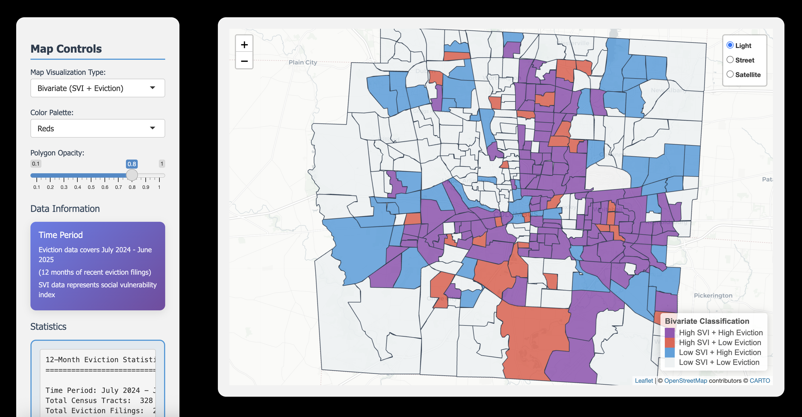

# Franklin County Eviction & Social Vulnerability Analysis



## Overview

This project creates a bivariate map showing both eviction filing data and Social Vulnerability Index (SVI) data for Franklin County, Ohio census tracts. The application allows users to explore the spatial distribution of eviction activity and its relationship to social vulnerability factors.

Created by Samyak Shrestha | Mentored by Dr. Ayaz Hyder and Special thanks to Dylan Sansone!

## Impact on Community Interventions

This analysis provides insights for organizations like Smart Columbus and other nonprofits working to address housing instability and homelessness prevention. By identifying census tracts with high eviction rates combined with high social vulnerability, these organizations can:

- Focus resources on areas with both high eviction filings and high SVI scores to maximize impact.
- Use spatial data to guide program design and identify opportunities for collaborative service delivery.
- Deploy proactive interventions like legal aid, rental assistance, and tenant education in high-risk communities.
- Support policy, advocacy, and grant applications with clear, data driven evidence of need and changing conditions.


## Features

- **Interactive Bivariate Mapping**: Visualize both eviction filings and SVI data simultaneously
- **Multiple View Modes**: Switch between bivariate, SVI-only, or eviction-only views
- **Real-time Statistics**: Statistics panel showing key metrics
- **Hover Information**: Detailed popups with tract-specific information
- **Layer Controls**: Multiple map tile options (Light, Street, Satellite)

## Data Sources

### Eviction Data
- **Source**: Eviction Tracking System (Princeton University)
- **Coverage**: Columbus, Ohio monthly eviction filings
- **Time Period**: July 2024 - June 2025 (12 months)
- **Level**: Census tract
- **Variables**: Total eviction filings per tract

### Social Vulnerability Index (SVI)
- **Source**: CDC/ATSDR Social Vulnerability Index
- **Coverage**: Franklin County, Ohio
- **Level**: Census tract
- **Variables**: Composite vulnerability score

### Geographic Data
- **Source**: Franklin County SVI Data (ESRI Shapefile)
- **Coverage**: Franklin County census tracts
- **Format**: Shapefile with 328 tracts

## Installation & Setup

### Prerequisites
- R (version 4.0 or higher)
- RStudio (recommended)

### Required R Packages
```r
install.packages(c(
  "shiny",
  "sf", 
  "leaflet",
  "dplyr",
  "readr",
  "RColorBrewer"
))
```

### Data Files Required
1. `columbus_monthly_2020_2021.csv` - Raw eviction data
2. `Franklin County SVI Data.shp` - Shapefile with tract boundaries and SVI data
3. `data_dictionary_monthly.xlsx` - Data dictionary for eviction variables

## Usage

### Running the Application

1. **Process the data** (first time only):
   ```r
   source("process_eviction_data_12months.R")
   ```

2. **Launch the Shiny app**:
   ```r
   source("hRisk_app.R")
   ```
   
   Or from terminal:
   ```bash
   Rscript hRisk_app.R
   ```

3. **Access the application**:
   - Open your web browser
   - Navigate to `http://127.0.0.1:XXXX` (port shown in terminal)

### Application Controls

- **Map Visualization Type**: Choose between bivariate, SVI-only, or eviction-only views
- **Color Palette**: Select different color schemes for individual variable maps
- **Opacity**: Adjust polygon transparency
- **Layer Controls**: Switch between different map backgrounds

## Data Processing

The application includes a data processing script (`process_eviction_data_12months.R`) that:

1. Loads raw eviction data from CSV
2. Filters for the past 12 months (July 2024 - June 2025)
3. Aggregates filings by census tract
4. Merges with SVI data and geographic boundaries
5. Creates normalized values for mapping
6. Exports processed data to CSV

## Key Statistics

Based on the 12-month analysis (July 2024 - June 2025):
- **Total Eviction Filings**: 24,954 across all tracts
- **Average Filings per Tract**: 76.1
- **Median Filings per Tract**: 45.0
- **Maximum Filings**: 348 (Tract 75.53)
- **Census Tracts Analyzed**: 328

## Project Structure

```
Homelessness/
├── README.md                          # This file
├── hRisk_app.R                        # Main Shiny application
├── process_eviction_data_12months.R   # Data processing script
├── columbus_monthly_2020_2021.csv     # Raw eviction data
├── Franklin County SVI Data.shp       # Geographic boundaries + SVI
├── data_dictionary_monthly.xlsx       # Data dictionary
├── eviction_svi_bivariate_data_12months.csv  # Processed data
└── .gitignore                         # Git ignore file
```

## Future Development

The next phase will map nonprofit and service organization locations in Franklin County using GEOID integration. This will allow for us to idenfy areas with high need but limited service coverage and where organizations can collaborate or expand services. Moreover, we will be able to visualzie exsiting service networks, identify partnership opportuniteis, and connect community needs with available resources.

## Data Privacy & Public Use

All data used in this project is publicly available:
- Eviction data from Princeton University's Eviction Tracking System
- SVI data from Franklin County Cares
- Geographic boundaries from standard census sources

## Contributing

Feel free to contribute by:
- Reporting bugs
- Suggesting new features
- Improving documentation
- Adding additional analyses

## License

This project is open source and available under the MIT License.

## References

Hepburn, P., Haas, J., Louis, R., Chapnik, A., Grubbs-Donovan, D., Jin, O., Rangel, J., & Desmond, M. (2020). Eviction Tracking System: Version 2.0. Princeton: Princeton University. www.evictionlab.org

Franklin County CARES. (n.d.). Indicator 9375 [Data set]. Franklin County CARES. Retrieved July 30, 2025, from https://www.franklincocares.org/indicators/index/view?indicatorId=9375&localeTypeId=4

U.S. Census Bureau. (2023). TIGER/Line Shapefile, 2023, County: Franklin County, OH - Topological faces polygons with all geocode [Data set]. Retrieved July 30, 2025, from https://catalog.data.gov/dataset/tiger-line-shapefile-2023-county-franklin-county-oh-topological-faces-polygons-with-all-geocode

## Contact

For questions or contributions, please open an issue on this GitHub repository. 