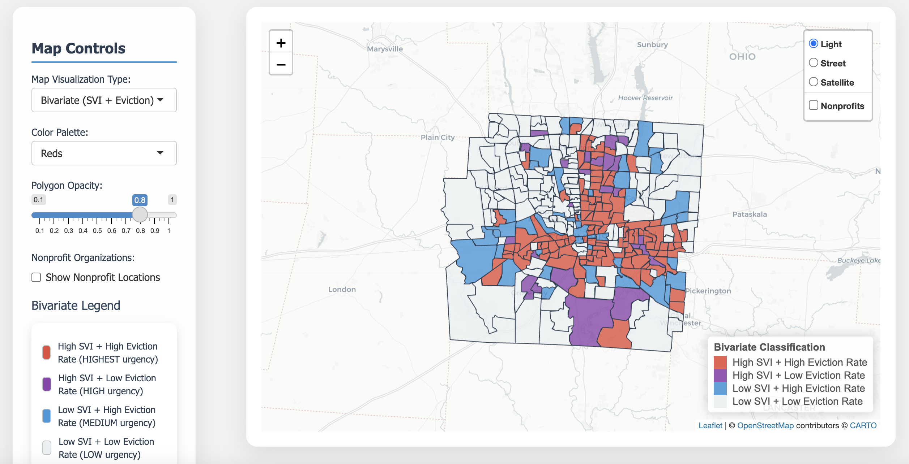

# Franklin County Homelessness Risk Analysis



## Overview

This application allows users to explore the spatial distribution of eviction activity and its relationship to social vulnerability factors, providing a tool for identifying high-risk areas and planning community interventions.

**This is a work in progress project.** The analysis and application are being actively developed and refined.

Created by Samyak Shrestha | Mentored by Dr. Ayaz Hyder and Special thanks to Dylan Sansone and the Smart Columbus Team!

### Live Application
**Access the application directly:** [Franklin County Homelessness Risk Analysis App](https://samyakshr-smartcolumbus.shinyapps.io/app_20250904_082903/)

No setup required - simply click the link to explore the interactive maps and statistical analysis dashboard.

## Impact on Community Interventions

This analysis provides insights for organizations like Smart Columbus and other nonprofits working to address housing instability and homelessness prevention. By identifying census tracts with high risk of homelessness, these organizations can:

- Focus resources on areas with both high eviction rates and high SVI scores to maximize impact.
- Use spatial data to guide program design and identify opportunities for collaborative service delivery.
- Deploy interventions like legal aid, rental assistance, and tenant education in high-risk communities.
- Support policy, advocacy, and grant applications with data-driven evidence of need and changing conditions.
- Prioritize interventions based on standardized eviction rates that account for population size differences.


## Features

### Interactive Mapping
- **Interactive Bivariate Mapping**: Visualize eviction rates (per 1,000 residents) and SVI data simultaneously
- **Multiple View Modes**: Switch between bivariate, SVI-only, or eviction rate views
- **Population Data Integration**: U.S. Census Bureau ACS 5-Year Estimates (2023) for all 328 census tracts
- **Enhanced Popups**: Display both eviction filings count AND eviction rate per 1,000 residents
- **Nonprofit Layer**: Toggle to show nonprofit organization locations across Franklin County with high-priority layering
- **Layer Controls**: Multiple map tile options (Light, Street, Satellite)
- **Risk Classification**: Color-coded bivariate classification with red indicating highest urgency areas

### Statistical Analysis 
- **Correlation Analysis**: SVI vs Eviction Rate scatterplots with statistical summaries
- **Demographic Analysis**: Box plots showing eviction rate distributions across racial/ethnic groups
- **Race-Specific Analysis**: Separate scatterplots for each racial majority group with individual correlation coefficients
- **Statistical Metrics**: Pearson correlation coefficients, R-squared values, and regression analysis
- **ANOVA Testing**: Statistical comparisons between demographic groups

### User Interface
- **Centered Tab Navigation**: Improved UI with centered tab buttons for better user experience
- **Comprehensive Data Dictionary**: Detailed variable definitions and data source information
- **Real-time Statistics**: Statistics panel showing key metrics including nonprofit count
- **Hover Information**: Detailed popups with tract-specific information and nonprofit details

## Data Sources

### Eviction Data
- **Source**: Franklin County Court System
- **Processing**: Aggregated by census tract and converted to eviction rates per 1,000 residents
- **Engineered by**: Samyak Shrestha
- **Coverage**: Franklin County, Ohio monthly eviction filings
- **Time Period**: July 2024 - June 2025 (12 months)


### Social Vulnerability Index (SVI)
- **Source**: CDC/ATSDR Social Vulnerability Index
- **Coverage**: Franklin County, Ohio

### Population Data
- **Source**: U.S. Census Bureau American Community Survey (ACS)
- **Coverage**: 5-Year Estimates (2019-2023)
- **Geographic Unit**: Census Tract level
- **File**: `ACSDT5Y2023.B01003-Data.csv`

### Geographic Data
- **Source**: Franklin County SVI Data (ESRI Shapefile)
- **Coverage**: Franklin County census tracts

### Nonprofit Organizations
- **Source**: Human Services Chamber of Franklin County, The Columbus Foundation
- **Engineered and Geocoded by**: Ayaz Hyder and Samyak Shrestha
- **Coverage**: Franklin County, Ohio
- **Total Organizations**: 1,342 nonprofit locations
- **Geographic Unit**: Point locations

## Data Limitations 

This analysis captures eviction court filings (not actual evictions) and uses SVI as a composite vulnerability measure. The temporal gap between 2022 SVI data and 2024-2025 eviction data can reveal areas where recent patterns differ from historical vulnerability trends, indicating emerging risks or successful interventions. The bivariate classification uses relative thresholds based on median values and shows spatial relationships rather than causal connections. 

The analysis now includes population data to calculate standardized eviction rates per 1,000 residents, eliminating bias from tract size differences. Use this analysis alongside local knowledge and additional data sources for comprehensive community planning.

## Installation & Setup

### Prerequisites
- R (version 4.0 or higher)
- RStudio (recommended)

### Required R Packages
```r
install.packages(c(
  "shiny",
  "sf", 
  "leaflet",
  "dplyr",
  "readr",
  "RColorBrewer",
  "scales"
))
```

### Data Files Required
1. `data/processed/eviction_svi_bivariate_data_12months.csv` - Processed eviction and SVI data
2. `data/raw/Franklin County SVI Data.shp` - Shapefile with tract boundaries and SVI data
3. `ACSDT5Y2023.B01003-Data.csv` - U.S. Census Bureau population data
4. `nonprofits_mapped/nonprofit_final_to_geocode.shp` - Nonprofit organization locations
5. `data_dictionary.csv` - Comprehensive data dictionary for all variables

## Usage

### Running the Application

1. **Process the data** (first time only):
   ```r
   source("scripts/process_eviction_data_12months.R")
   ```

2. **Launch the Shiny app**:
   ```r
   source("scripts/hRisk_app.R")
   ```
   
   Or from terminal:
   ```bash
   Rscript -e "shiny::runApp('scripts/hRisk_app.R', port = 3838, launch.browser = TRUE)"
   ```

3. **Access the application**:
   - Open your web browser
   - Navigate to `http://127.0.0.1:XXXX` (port shown in terminal)

### Application Controls

#### Interactive Map Tab
- **Map Visualization Type**: Choose between bivariate, SVI-only, or eviction-only views
- **Color Palette**: Select different color schemes for individual variable maps
- **Opacity**: Adjust polygon transparency
- **Nonprofit Organizations**: Toggle to show/hide nonprofit locations on the map
- **Layer Controls**: Switch between different map backgrounds

#### Statistical Analysis Tab
- **Analysis Type Selection**: Choose between correlation analysis or demographic analysis
- **SVI vs Eviction Rate Correlation**: View overall scatterplot with statistical summary
- **Race-Specific Analysis**: Examine relationships within each racial/ethnic group
- **Demographic Analysis**: Compare eviction rates across different demographic groups

## Data Processing

The application includes a data processing script (`scripts/process_eviction_data_12months.R`) that:

1. Loads raw eviction data from CSV
2. Filters for the past 12 months (July 2024 - June 2025)
3. Aggregates filings by census tract
4. Merges with SVI data and geographic boundaries
5. Creates normalized values for mapping
6. Exports processed data to CSV

## Project Structure

```
franklin-county-homelessnessrisk-analysis/
├── README.md                          
├── images/                            
│   └── Screenshot.png              
├── data/                              
│   ├── raw/                        
│   │   ├── Franklin County SVI Data.shp
│   │   └── [other shapefile components]
│   └── processed/                   
│       └── eviction_svi_bivariate_data_12months.csv
├── nonprofits_mapped/                 
│   ├── nonprofit_final_to_geocode.shp
│   └── [other shapefile components]
├── scripts/                         
│   ├── hRisk_app.R                   
│   └── process_eviction_data_12months.R
├── deploy/                          
│   ├── app.R                         
│   └── [deployment files]
├── ACSDT5Y2023.B01003-Data.csv      
├── data_dictionary.csv              
└── .gitignore                     
```

## License

This project is open source and available under the MIT License.

## References

U.S. Census Bureau. (2023). American Community Survey 5-Year Estimates (2019-2023). Retrieved from https://www.census.gov/programs-surveys/acs/

Centers for Disease Control and Prevention. (n.d.). Social Vulnerability Index (SVI). Retrieved from https://www.atsdr.cdc.gov/placeandhealth/svi/index.html

Peter Hepburn, Jacob Haas, Renee Louis, Adam Chapnik, Danny Grubbs-Donovan, Olivia Jin, Jasmine Rangel, and Matthew Desmond. Eviction Tracking System: Version 2.0. Princeton: Princeton University, 2020. www.evictionlab.org

Human Services Chamber of Franklin County & The Columbus Foundation. (2024). Nonprofit organization locations. Columbus, OH.

U.S. Census Bureau. (2023). TIGER/Line Shapefile, 2023, County: Franklin County, OH - Topological faces polygons with all geocode [Data set]. Retrieved from https://catalog.data.gov/dataset/tiger-line-shapefile-2023-county-franklin-county-oh-topological-faces-polygons-with-all-geocode

## Contact

For questions or contributions, please open an issue on this GitHub repository. 